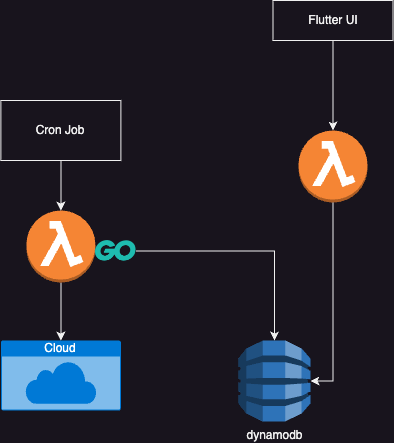

# unused-cloud-resources
This project is to fetch the unused AWS resources and potentially list them but primarily use for FinOps intented to generate KPI.

# KPI Metrics
1. Unused EBS Volumes
2. Unused PublicIPs
3. (TBD)

KPI is the Key performance Indicator which acts as a goal for an organisation to evaluate and track the efficiency of the FinOps Policies implemented.

Unused EBS Volumes will be representd by `Number of EBS Volumes` vs `Total Number of EBS Volumes` and probably a percentage indicator. (or possibly changed later)

# Architecture Diagram



# File Structure

[aws_unused_resources.go](aws_unused_resources.go) is the file where the code resides which will be triggered periodically by a cronjob which will fetch the required metrics such as unused EBS volumes or unattached Public IPs etc.

[gin_example.go](gin_example.go) Contains code for the API server which will be used to fetch the data stored from the [aws_unused_resources.go](aws_unused_resources.go) in a DynamoDB. This inturn will be consumed by a Front end application build using Flutter to display the KPI dashboard.


# Instructions to run

For local testing purposes install Go version `1.22.5` then run.

```zsh
go run aws_main.go

go run gcp_auth.go
```